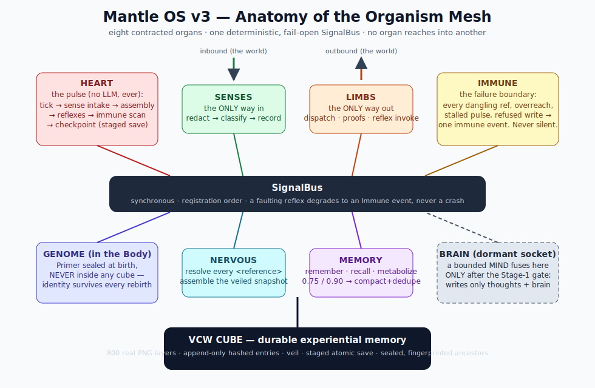
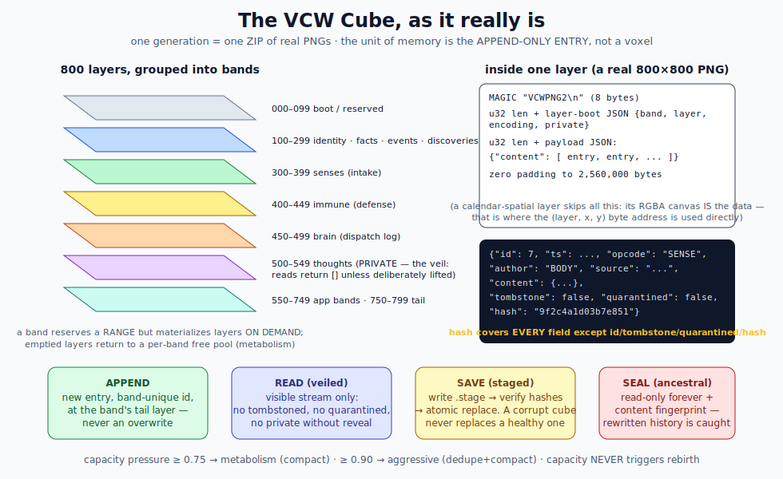
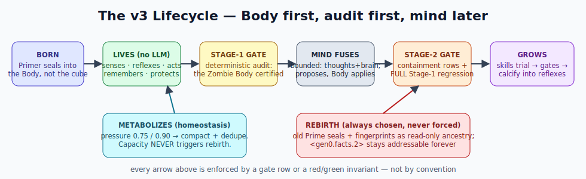
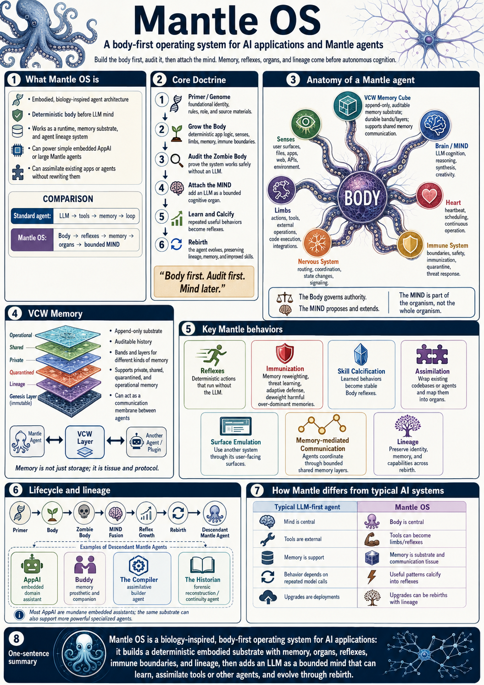
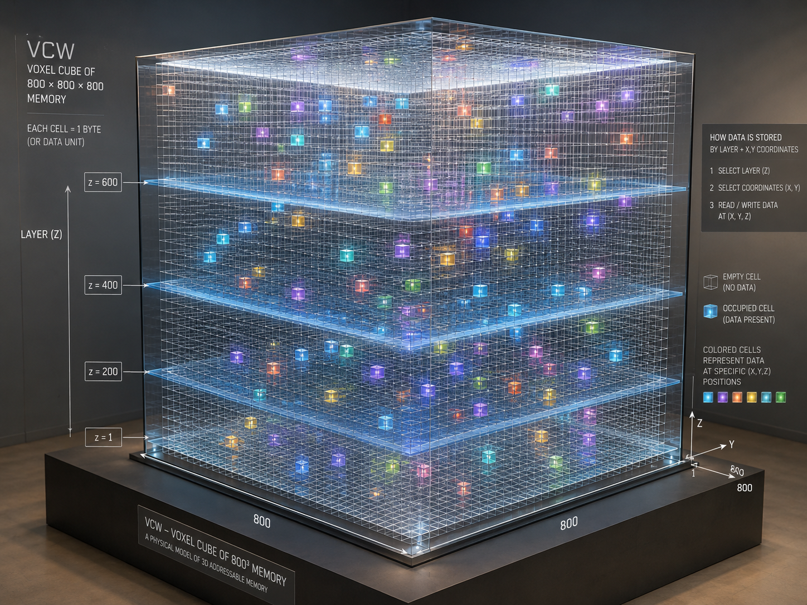

# Mantle OS — Visual Guide

*Pictures for humans, text-native diagrams for agents. Everything in `documents/assets/`.*

Two kinds of visuals live here, deliberately:

1. **Rendered art** (PNG/JPG) — the fastest way for a *human* to grasp the project.
   Renders are kept even when details age, with a caption stating what changed.
2. **SVG diagrams** — current, versionable, diffable, rendered by GitHub, and
   **readable by coding agents as plain XML text**. When art and SVG disagree, the SVG
   (and ultimately the code) wins.

---

## The diagrams (normative-ish: kept in sync with the code)

### Anatomy of the organism mesh

Eight contracted organs on one deterministic, fail-open SignalBus. The three absolute
boundaries: inbound only through **Senses**, outbound only through **Limbs**, every fault
through **Immune**. The Heart's fixed pulse order. The **Genome lives in the Body**, never
in a cube. The **Brain is a dormant socket** until a bounded MIND fuses — which requires a
passed Stage-1 gate.

### The VCW cube, as it really is

One generation = one ZIP of real PNG layers, grouped into named bands. The unit of memory
is the **append-only hashed entry**, not a freely writable cell. Shows the layer pixel
stream, the entry schema with the total hash rule, the veil, the staged save, sealing,
and the capacity doctrine (0.75 / 0.90 → metabolism, never rebirth). The runnable
companion is [`examples/vcw/vcw_cube.py`](../../examples/vcw/vcw_cube.py).

### The lifecycle

Born → lives with no LLM → Stage-1 gate → bounded MIND → Stage-2 gate → grows skills —
with the homeostatic loop (metabolism) and chosen rebirth underneath. Every arrow is
enforced by a gate row or invariant, not convention.

---

## The legacy renders (human on-ramp; v2-era — read with these captions)

The two renders live in `documents/assets/` as `mantle_poster.png` and `vcw_cube_render.png`.

### The Mantle OS poster (`documents/assets/mantle_poster.png`)

**Still true:** body-first order; the doctrine sequence (Primer → grow → audit →
MIND → calcify → rebirth); the octopus anatomy framing; the lifecycle-and-lineage row;
the "how Mantle differs" comparison; the one-sentence summary.

**Read with the current code in mind:**
- The canonical organ set is **eight**, and the **Genome is Body-resident** — identity is
  never inside the cube (HF-B45).
- The current code added things the poster predates: the **SignalBus** with enforced **organ
  contracts**, executable **capacity thresholds** (0.75 overflow / 0.90 emergency →
  metabolism, never rebirth), **seal fingerprints** on ancestors, **audit-before-fusion**
  (fusion is *refused* without a certified Stage-1 gate), and the **AppAIRuntime** for
  agents.
- "Immunization / memory reweighting" on the poster is doctrine-level; in the current code the
  immune toolkit is concretely: redaction at the boundary, scan, tombstone, quarantine,
  dedupe — plus every violation class becoming an immune event.

### The voxel cube render (`documents/assets/vcw_cube_render.png`)

A beautiful intuition for the cube's **addressability** — and one correction matters:

- The render shows an 800³ byte store with "read/write data at (x,y,z)". The real cube is
  **800 PNG layers** of 800×800×4 RGBA bytes. The `(layer, x, y)` byte address is a real
  primitive — but it is used directly only by **spatial drivers** (the calendar canvas)
  and low-level tools.
- Normal memory is **append-only entry streams**: you never "write at a coordinate," you
  append a hashed entry to a band and read through the veil. There is no arbitrary
  in-place write anywhere in the doctrine — that is the whole point.
- "Each cell = 1 byte" is true arithmetically (2,560,000 bytes per layer); the meaningful
  units are *entry* (experience), *layer* (a real image), *band* (a purpose), *cube*
  (a generation).

---

## House rules for project visuals

- Binary art lives in `documents/assets/`, referenced from docs with a caption that dates it
  and states any divergence from current code. Never silently delete old art — it is
  lineage.
- Diagrams meant to track the architecture are **SVG, hand-editable, committed as text**,
  so agents can read them and diffs review them.
- When a visual and the code disagree, the code is ground truth; fix the caption first,
  the art when convenient.
